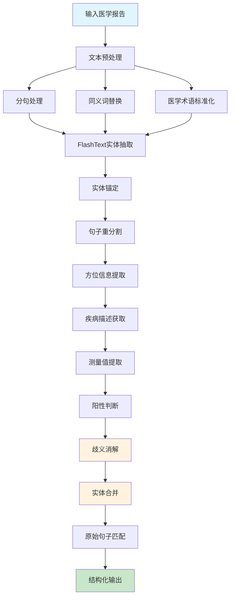

# 医学放射报告实体抽取项目技术文档

- **文档版本**: v1.0
- **更新日期**: 2025-08-14
- **作者**: 吴明祥,MiniMax Agent
- **联系方式**: <150407170@qq.com>

---

## 📋 目录

1. [项目概述](#1-项目概述)
2. [技术架构](#2-技术架构)
3. [核心模块详解](#3-核心模块详解)
4. [配置系统](#4-配置系统)
5. [数据结构](#5-数据结构)
6. [使用指南](#6-使用指南)
7. [部署说明](#7-部署说明)
8. [性能优化](#8-性能优化)
9. [扩展开发](#9-扩展开发)
10. [常见问题](#10-常见问题)

---

## 1. 项目概述

### 1.1 项目简介

本项目是一个基于Python开发的医学放射报告实体抽取系统，专门用于从医学影像报告（CT、MR、DR等）中自动提取和识别解剖部位实体，并分析其相关属性信息。本项目为实时性进行了极致优化，采用知识图谱和规则引擎实现，在12600kf CPU上开启并行处理，可达到0.4ms/份报告处理速度。本项目的另一个目的是为建立实体抽取模型准备足够的冷启动数据，以方便后续模型训练。

### 1.2 主要功能

- **实体识别**：基于FlashText和医学知识图谱，快速准确识别医学报告中的解剖部位（微秒级）
- **实体链接**：本项目相比深度学习算法的最大优势，就是在实体识别的同时进行实体标准化和实体链接，建立实体的标准化关系链
- **属性提取**：自动提取实体的方位信息（左/右/双侧）、疾病描述、测量值等。能通过上下文自动补全方位信息，通过基本语法预测提取疾病描述
- **歧义消解**：处理医学术语的多义性问题，结合上下文、检查部位、先验知识选择最佳候选
- **实体合并**：智能合并同一解剖分支的父子节点，避免冗余
- **阳性判断**：基于规则和测量值判断病理发现的阳性/阴性状态，内置常用正常值，可自定义添加。
- **批量处理**：支持大规模医学报告的批量处理，包含多进程优化。在12600kf CPU上开启并行处理，可达到0.4ms/份报告处理速度。

### 1.3 应用场景

- 医学影像报告的结构化处理
- 医学知识图谱构建
- 临床决策支持系统
- 医学文本挖掘和分析
- 质量控制和统计分析

### 1.4 技术特点

- **高性能**：基于FlashText算法，处理速度快
- **垂体领域定制**：医学知识图谱和多层次规则，源自十多家医院的私域知识和行业独有术语，**不在大语言模型的预训练语料中**。
- **可配置**：支持多种设备类型和处理模式
- **可扩展**：模块化设计，易于功能扩展
- **缓存优化**：LRU缓存机制，提升重复处理效率
---

## 2. 技术架构

### 2.1 整体架构

```
医学放射报告实体抽取系统
├── 输入层（Report Input）
│   ├── 报告描述（ReportStr）
│   ├── 报告结论（ConclusionStr）
│   ├── 检查部位（StudyPart）
│   └── 申请单信息（applyTable）
│
├── 预处理层（Preprocessing Layer）
│   ├── 文本清洗
│   ├── 分句处理
│   ├── 同义词替换
│   └── 医学术语标准化
│
├── 实体识别层（Entity Recognition Layer）
│   ├── FlashText关键词抽取
│   ├── 知识图谱匹配
│   ├── 实体锚定
│   └── 句子重分割
│
├── 属性提取层（Attribute Extraction Layer）
│   ├── 方位信息提取
│   ├── 疾病描述获取
│   ├── 测量值提取
│   └── 阳性判断
│
├── 后处理层（Post-processing Layer）
│   ├── 歧义消解
│   ├── 实体合并
│   ├── 原始句子匹配
│   └── 结果整理
│
└── 输出层（Output Layer）
    └── 结构化实体列表
```

### 2.2 核心处理流程

1. **医学报告输入** → 接收报告文本和元数据
2. **文本预处理** → 清洗、分句、标准化
3. **FlashText实体抽取** → 基于知识图谱的快速匹配
4. **实体锚定与句子重分割** → 智能句子切分
5. **方位信息提取** → 识别左/右/双侧信息
6. **疾病描述获取** → 提取相关病理描述
7. **测量值提取与阳性判断** → 数值分析和状态判断
8. **歧义消解** → 多候选实体的智能选择
9. **实体合并** → 父子节点的合理合并
10. **原始句子匹配** → 恢复原始文本关联
11. **结构化输出** → 生成最终结果

### 2.3 技术栈

- **核心语言**：Python 3.7+
- **主要依赖**：
  - FlashText：高速关键词匹配
  - pandas：数据处理和Excel文件操作
  - numpy：数值计算
  - tqdm：进度条显示
  - pydantic：数据验证
  - configparser：配置文件管理
  - multiprocessing：多进程支持

---

## 3. 核心模块详解

### 3.1 主模块（Extract_Entities.py）

#### 3.1.1 核心类和函数

**Report类**
```python
class Report(BaseModel):
    ConclusionStr: str    # 报告结论
    ReportStr: str        # 报告描述  
    modality: str         # 设备类型（CT/MR/DR）
    StudyPart: str        # 检查条目名称
    Sex: str              # 性别
    applyTable: str       # 申请单信息
```

**主要处理函数**

- `build_unified_processor()`: 构建统一的FlashText处理器
- `Extract_Keywords()`: 关键词抽取（支持缓存）
- `resplit_sentence_by_entities()`: 基于实体的句子重分割
- `find_measure()`: 测量值提取（长度、百分比、体积）
- `get_positive()`: 阳性判断
- `text_extrac_process()`: 文本处理主流程
- `report_extrac_process()`: 报告处理主流程

#### 3.1.2 知识图谱处理

系统支持两套知识图谱：
- **报告知识图谱**（knowledgegraph.xlsx）：用于报告描述和结论
- **标题知识图谱**（knowledgegraph_title.xlsx）：用于检查部位标题

知识图谱结构：
```
一级部位 → 二级部位 → 三级部位 → 四级部位 → 五级部位 → 六级部位
```

每个层级支持同义词（用 | 分隔），并包含坐标范围信息。

#### 3.1.3 句子重分割算法

基于实体位置智能分割长句，采用"分割-过滤-合并"策略：

1. **分割**：按标点符号分割子句
2. **过滤**：移除无实体且为模板语句的子句
3. **合并**：将有强依存关系的相邻子句重新合并

### 3.2 预处理模块（tools/medical_preprocessor.py）

#### 3.2.1 功能特性

- **多版本支持**：报告、标题、申请单三种处理模式
- **设备特定**：支持CT、MR、DR等不同设备的专用规则
- **医学术语扩展**：椎体范围、肋骨范围等医学表达的智能扩展
- **缓存优化**：LRU缓存提升重复处理效率

#### 3.2.2 核心类

**MedicalPatterns类**
预编译的医学正则表达式模式：
```python
class MedicalPatterns:
    SPINE_C = re.compile(r'(?<![a-zA-Z])C([1-8])(?![0-9段])')  # 颈椎
    SPINE_T = re.compile(r'(?<![a-zA-Z])T(1[0-2]|[1-9])(?![0-9wW])')  # 胸椎
    SPINE_L = re.compile(r'(?<![a-zA-Z])L([1-5])(?![0-9])')  # 腰椎
    RIB_RANGE = re.compile(...)  # 肋骨范围
    DISK_SIMPLE = re.compile(...)  # 椎间盘
```

**ReplacementRules类**
替换规则管理器，支持：
- 简单文本替换
- 正则表达式替换
- 高优先级规则（高频词）
- 从Excel文件动态加载规则

#### 3.2.3 医学术语扩展

支持多种医学表达的智能扩展：

- **椎体范围**："腰3、4" → "腰3、腰4"
- **椎间盘**："L3/4-L5/S1" → "腰3腰4椎间盘、腰5骶1椎间盘"
- **肋骨范围**："第3-5肋骨" → "第3肋骨、第4肋骨、第5肋骨"

### 3.3 歧义消解模块（tools/disambiguation.py）

#### 3.3.1 歧义消解策略

采用多层次策略解决实体歧义：

1. **先验知识过滤**：基于句子内容的专业知识判断
2. **检查部位匹配**：与申请的检查部位信息匹配
3. **上下文partlist匹配**：与邻近实体的部位层级匹配
4. **上下文axis匹配**：与邻近实体的坐标范围匹配
5. **扩展坐标匹配**：考虑更广泛的坐标关系
6. **兜底策略**：默认选择机制

#### 3.3.2 核心算法

**坐标交叉判断**
```python
def _interval_cross(interval1: Tuple[float, float], 
                   interval2: Tuple[float, float]) -> bool:
    """判断两个区间是否有交集"""
    return max(interval1[0], interval2[0]) < min(interval1[1], interval2[1])
```

**上下文构建**
采用前后文交替策略，优先考虑距离较近的实体。


### 3.4 实体合并模块（tools/entity_merge.py）

#### 3.4.1 合并策略

**报告模式**：优先保留更具体的子节点
- 合并条件：父子关系 + 方位兼容 + 阳性状态一致

**标题模式**：根据分隔符决定合并方向
- 有特殊分隔符（\\|/|+）：保留子节点
- 无特殊分隔符：保留父节点

#### 3.4.2 去重机制

基于实体的关键字段创建唯一标识：
```python
key_fields = [
    sentence_index,
    sentence_start,
    start,
    keyword,
    partlist,
    orientation
]
```

### 3.5 属性提取模块（tools/Get_Attributes.py）

#### 3.5.1 方位信息提取

**两轮处理机制**：
1. **显式方位词提取**：在关键词前后查找明确的方位词
2. **上下文推理补充**：基于邻近实体的方位信息进行推理

**方位词模式**：
- 前置模式："左肺"
- 后置括号模式："肺（左侧）"

#### 3.5.2 疾病描述提取

**三种句式模式**：

1. **否定前置**："未见 + 实体 + 描述"
2. **倒置句**："描述 + 实体"
3. **默认后置**："实体 + 描述"

**连接词处理**：
支持"伴有"、"合并"等连接词的子句分割。

---

## 4. 配置系统

### 4.1 主配置文件（config/config.ini）

配置文件采用INI格式，包含以下主要部分：

#### 4.1.1 句子处理配置 [sentence]
```ini
[sentence]
stop_pattern = \?|？|。|；|;|,|，|\n|\r
tipwords = 旁|位置|水平(?!裂)|平面|层面
STRONG_DEPENDENCY_KEYWORDS = 压迫|侵犯|推移|导致|引起
BOILERPLATE_KEYWORDS = 临时|换|结合临床|进一步|建议
```

#### 4.1.2 文本清洗配置 [clean]
```ini
[clean]
punctuation = [:|：|。|；|？|、|;|?|\n|\r|\t|(|)|（|）|"|"| ]
ignore_keywords = (随访|复查|检查)(除外|排除)|新生儿|早产儿
stopwords = 左侧|右侧|双侧|及|区| |左|右|伴|和|并
```

#### 4.1.3 阳性判断配置 [positive]
```ini
[positive]
absolute_norm = 均匀强化|强化均匀|密度|密度均匀
absolute_illness = 未见|硬化|缺如|缺失
illness_words = 不对称|不均|不通|欠完整
```

#### 4.1.4 方位配置 [orientation]
```ini
[orientation]
bilateral_organs = 额叶|顶叶|枕叶|颞叶|肾脏|乳房
single_organs = 盆腔|椎体|脑干|子宫|前列腺|胃|脾
```

### 4.2 知识图谱文件

#### 4.2.1 文件结构
- **knowledgegraph.xlsx**：报告实体知识图谱
- **knowledgegraph_title.xlsx**：标题实体知识图谱

#### 4.2.2 字段说明
| 字段 | 说明 | 示例 |
|------|------|------|
| 一级部位 | 最顶层解剖分类 | 颅脑 |
| 二级部位 | 二级解剖分类 | 颅骨\|头颅骨 |
| 三级部位 | 三级解剖分类 | 颅底\|颅底骨 |
| 起始坐标 | 在知识图谱中的起始位置 | 1.0 |
| 终止坐标 | 在知识图谱中的终止位置 | 2.0 |

### 4.3 替换规则文件

#### 4.3.1 文件类型
- **replace.xlsx**：报告模式替换规则
- **replace_title.xlsx**：标题模式替换规则
- **replace_applytable.xlsx**：申请单模式替换规则

#### 4.3.2 替换规则结构
- **Sheet 0**：直接文本替换规则
- **Sheet 1**：正则表达式替换规则
- **设备特定Sheet**：CT/MR/DR特定规则

### 4.4 其他配置文件

#### 4.4.1 忽略规则（ignore_reports.json）
```json
[
    {"modality": "DX", "部位": "骨龄"},
    {"modality": "MR", "部位": "心脏"}
]
```

#### 4.4.2 正常测量值（Normal_measurement.xlsx）
定义各种测量指标的正常值范围，用于阳性判断。

---

## 5. 数据结构

### 5.1 输入数据结构

#### 5.1.1 Report对象
```python
{
    "ConclusionStr": "报告结论文本",
    "ReportStr": "报告描述文本",
    "modality": "CT",
    "StudyPart": "胸部CT",
    "Sex": "男",
    "applyTable": "申请单信息"
}
```

### 5.2 中间数据结构

#### 5.2.1 实体锚点（Entity Anchor）
```python
{
    "keyword": "肺",                    # 匹配到的关键词
    "axis": [(1.0, 2.0)],             # 坐标信息（可能多个）
    "start": 10,                      # 在句子中的起始位置
    "end": 12,                        # 在句子中的结束位置
    "partlist": [("颅脑", "肺")],       # 部位层级（可能多个）
    "position": "肺",                 # 标准化部位名称
    "sentence_index": 0,              # 句子索引
    "sentence_start": 0,              # 句子在原文中的起始位置
    "long_sentence": "原始长句",       # 原始长句
    "short_sentence": "实际短句",      # 重分割后的短句
    "original_sentence": "原始句子"    # 最初的句子
}
```

### 5.3 输出数据结构

#### 5.3.1 最终实体对象
```python
{
    "keyword": "肺",                    # 关键词
    "position": "肺",                 # 标准化部位
    "partlist": [("颅脑", "肺")],       # 部位层级
    "axis": [(1.0, 2.0)],             # 坐标信息
    "orientation": "左",              # 方位信息
    "illness": "结节",                # 疾病描述
    "positive": True,                 # 是否阳性
    "measure": 12.5,                  # 测量值（mm）
    "percent": 0.0,                   # 百分比
    "volume": 0.0,                    # 体积（ml）
    "short_sentence": "处理后的句子",   # 处理后句子
    "original_short_sentence": "原始句子", # 原始匹配句子
    "sentence_index": 0,              # 句子索引
    "start": 10,                      # 起始位置
    "end": 12                         # 结束位置
}
```


---

## 6. 使用指南

### 6.1 基本使用

#### 6.1.1 单个报告处理
```python
from Extract_Entities import report_extrac_process, Report

# 创建报告对象
report = Report(
    ReportStr="肺部可见结节影，直径约10mm。",
    ConclusionStr="左肺结节。",
    StudyPart="胸部CT",
    Sex="男",
    modality="CT",
    applyTable="胸痛3天"
)

# 处理报告
result = report_extrac_process(report)
print(result)
```

#### 6.1.2 文本直接处理
```python
from Extract_Entities import text_extrac_process

# 处理文本
text = "左肺上叶见结节影，大小约12×8mm。"
result = text_extrac_process(text, version='报告', modality='CT')

for entity in result:
    print(f"部位: {entity['position']}, 方位: {entity['orientation']}, "
          f"疾病: {entity['illness']}, 阳性: {entity['positive']}")
```

### 6.2 批量处理

#### 6.2.1 Excel文件处理
```python
from test import process_corpus_excel_files

# 处理corpus目录下的所有Excel文件
result_df = process_corpus_excel_files(
    corpus_dir='corpus',     # Excel文件目录
    num_processes=12         # 进程数
)

# 保存结果
result_df.to_excel('output.xlsx', index=False)
```

#### 6.2.2 自定义批量处理
```python
import pandas as pd
from Extract_Entities import report_extrac_process, Report

# 读取数据
df = pd.read_excel('reports.xlsx')
results = []

for _, row in df.iterrows():
    report = Report(
        ReportStr=row['描述'],
        ConclusionStr=row['结论'],
        StudyPart=row['部位'],
        Sex=row['性别'],
        modality=row['类型'],
        applyTable=row['申请单']
    )
    
    entities = report_extrac_process(report)
    for entity in entities:
        entity['Accno'] = row['影像号']
        results.append(entity)

# 转换为DataFrame
result_df = pd.DataFrame(results)
```

### 6.3 配置自定义

#### 6.3.1 添加新的替换规则
1. 编辑对应的Excel文件（如replace.xlsx）
2. 在适当的sheet中添加规则
3. 重启系统以加载新规则

#### 6.3.2 扩展知识图谱
1. 编辑knowledgegraph.xlsx
2. 添加新的解剖部位和层级关系
3. 确保坐标范围的正确性

#### 6.3.3 调整阳性判断规则
编辑config.ini中的[positive]部分：
```ini
[positive]
# 添加新的绝对阳性词
absolute_illness = 未见|硬化|新增阳性词
# 添加新的疾病特征词
illness_words = 不对称|不均|新增特征词
```

---

## 7. 部署说明

### 7.1 系统要求

- **操作系统**：Windows 10+ / Linux / macOS
- **Python版本**：3.7+
- **内存要求**：推荐8GB+（大规模处理时）
- **存储空间**：1GB+（包含知识图谱和模型）

### 7.2 依赖安装

#### 7.2.1 核心依赖
```bash
uv pip install pandas numpy tqdm pydantic configparser
```

#### 7.2.2 FlashText安装
确保flashtext目录下的keyword.py文件可用，这是修改过的FlashText版本。

### 7.3 配置部署

#### 7.3.1 目录结构
```
project/
├── Extract_Entities.py          # 主模块
├── test.py                      # 测试模块
├── config/                      # 配置目录
│   ├── config.ini              # 主配置文件
│   ├── knowledgegraph.xlsx     # 知识图谱
│   ├── replace.xlsx            # 替换规则
│   └── ...
├── tools/                       # 工具模块
│   ├── medical_preprocessor.py
│   ├── disambiguation.py
│   └── ...
└── flashtext/                   # FlashText模块
    └── keyword.py
```

#### 7.3.2 权限设置
确保Python进程具有读取配置文件和写入输出文件的权限。

### 7.4 性能调优

#### 7.4.1 多进程配置
根据服务器CPU核数调整进程数：
```python
# 推荐设置为CPU核数的80%
num_processes = int(multiprocessing.cpu_count() * 0.8)
```

#### 7.4.2 缓存配置
调整LRU缓存大小：
```python
# 在相关函数上调整maxsize参数
@lru_cache(maxsize=2560)  # 根据内存情况调整
def cached_function():
    pass
```

---

## 8. 性能优化

### 8.1 处理速度优化

#### 8.1.1 FlashText优化
- 预编译关键词处理器
- 使用统一处理器减少重复构建
- 针对不同版本（报告/标题）使用专用处理器

#### 8.1.2 缓存策略
- 句子处理结果缓存（LRU）
- 歧义消解结果缓存
- 测量值提取缓存

#### 8.1.3 批量处理优化
```python
# 使用多进程池
with multiprocessing.Pool(processes=num_processes) as pool:
    results = pool.map(process_function, data_chunks)

# 使用生成器减少内存占用
def process_generator(data):
    for item in data:
        yield process_item(item)
```

### 8.2 内存优化

#### 8.2.1 数据结构优化
- 使用适当的数据类型
- 及时清理临时变量
- 避免重复存储相同数据

#### 8.2.2 分批处理
```python
# 大文件分批处理
chunk_size = 10000
for chunk in pd.read_excel('large_file.xlsx', chunksize=chunk_size):
    process_chunk(chunk)
```

### 8.3 准确性优化

#### 8.3.1 规则优化
- 定期更新医学术语库
- 基于实际数据调整阳性判断阈值
- 完善歧义消解规则

#### 8.3.2 质量监控
```python
# 添加处理质量统计
def quality_check(results):
    total = len(results)
    positive_rate = sum(1 for r in results if r['positive']) / total
    print(f"总实体数: {total}, 阳性率: {positive_rate:.2%}")
```


---

## 9. 扩展开发

### 9.1 新增疾病类型支持

#### 9.1.1 扩展知识图谱
1. 在Excel文件中添加新的解剖部位
2. 确保层级关系的正确性
3. 设置合适的坐标范围

#### 9.1.2 更新配置规则
```ini
# 在config.ini中添加新的疾病特征词
[positive]
illness_words = 现有词汇|新增疾病特征|新症状描述
```

### 9.2 新增设备类型支持

#### 9.2.1 创建设备专用配置
```python
# 在medical_preprocessor.py中添加新设备支持
VERSION_FILE_MAP = {
    '报告': 'replace.xlsx',
    '标题': 'replace_title.xlsx',
    '申请单': 'replace_applytable.xlsx',
    '新设备': 'replace_new_device.xlsx'  # 新增
}
```

#### 9.2.2 设备特定处理逻辑
```python
def device_specific_processing(text, modality):
    if modality == 'NEW_DEVICE':
        # 新设备的特殊处理逻辑
        text = special_preprocessing(text)
    return text
```

### 9.3 新增属性提取

#### 9.3.1 扩展属性提取器
```python
def extract_new_attribute(entity, context):
    """提取新的实体属性"""
    # 实现新属性的提取逻辑
    new_attr = analyze_context(entity, context)
    return new_attr

# 在主处理流程中集成
def enhanced_processing(entities):
    for entity in entities:
        entity['new_attribute'] = extract_new_attribute(entity, context)
    return entities
```

#### 9.3.2 属性验证
```python
def validate_attributes(entity):
    """验证提取的属性的合理性"""
    checks = [
        entity.get('orientation') in ['左', '右', '双', ''],
        isinstance(entity.get('positive'), bool),
        entity.get('measure', 0) >= 0
    ]
    return all(checks)
```

### 9.4 API接口开发

#### 9.4.1 REST API示例
```python
from flask import Flask, request, jsonify
from Extract_Entities import text_extrac_process

app = Flask(__name__)

@app.route('/extract', methods=['POST'])
def extract_entities():
    data = request.json
    text = data.get('text', '')
    modality = data.get('modality', 'CT')
    
    try:
        result = text_extrac_process(text, modality=modality)
        return jsonify({
            'status': 'success',
            'entities': result
        })
    except Exception as e:
        return jsonify({
            'status': 'error',
            'message': str(e)
        }), 500

if __name__ == '__main__':
    app.run(host='0.0.0.0', port=5000)
```

#### 9.4.2 异步处理
```python
import asyncio
from concurrent.futures import ThreadPoolExecutor

async def async_extract(text, modality='CT'):
    """异步实体提取"""
    loop = asyncio.get_event_loop()
    with ThreadPoolExecutor() as executor:
        result = await loop.run_in_executor(
            executor, text_extrac_process, text, 'report', modality
        )
    return result
```

---

## 10. 常见问题

### 10.1 性能问题

**Q: 处理速度慢怎么办？**

A: 
1. 检查是否启用了缓存
2. 调整多进程数量
3. 减少知识图谱大小（如果可能）
4. 优化正则表达式

**Q: 内存占用过高？**

A:
1. 使用分批处理
2. 调整缓存大小
3. 及时清理临时变量
4. 检查是否有内存泄漏

### 10.2 准确性问题

**Q: 实体识别错误率高？**

A:
1. 检查知识图谱的完整性
2. 更新同义词映射
3. 调整歧义消解规则
4. 增加领域特定的预处理规则

**Q: 阳性判断不准确？**

A:
1. 检查测量值正常范围设置
2. 更新疾病特征词库
3. 调整阳性判断阈值
4. 增加否定词库

### 10.3 配置问题

**Q: 配置文件加载失败？**

A:
1. 检查文件路径是否正确
2. 确认文件权限
3. 验证INI文件格式
4. 检查字符编码（应为UTF-8）

**Q: Excel文件读取错误？**

A:
1. 确认Excel文件格式正确
2. 检查字段名称
3. 验证数据类型
4. 确保文件未被占用

### 10.4 扩展问题

**Q: 如何添加新的医学术语？**

A:
1. 在知识图谱Excel中添加新词
2. 更新同义词映射
3. 考虑层级关系
4. 测试验证效果

**Q: 如何支持新的语言或地区？**

A:
1. 创建对应的配置文件
2. 调整正则表达式模式
3. 更新医学术语库
4. 适配本地化格式

---

## 📞 技术支持

如有技术问题或需要进一步的定制开发，请联系：

- **文档版本**: v1.0
- **更新日期**: 2025-08-14
- **作者**: 吴明祥,MiniMax Agent
- **联系方式**: <150407170@qq.com>

---

## 🔄 版本历史

| 版本 | 日期 | 更新内容 |
|------|------|----------|
| v1.0 | 2025-08-14 | 初始版本，完整的技术文档 |

---

## 📁 项目文件结构总览

```
project/
├── Extract_Entities.py              # 主实体抽取模块
├── test.py                          # 测试和批量处理模块
├── output.json                      # 示例输出文件
├── config/                          # 配置文件目录
│   ├── config.ini                  # 主配置文件
│   ├── ignore_reports.json         # 忽略规则配置
│   ├── knowledgegraph.xlsx         # 报告实体知识图谱
│   ├── knowledgegraph_title.xlsx   # 标题实体知识图谱
│   ├── Normal_measurement.xlsx     # 正常测量值范围
│   ├── replace.xlsx                # 报告模式替换规则
│   ├── replace_title.xlsx          # 标题模式替换规则
│   └── replace_applytable.xlsx     # 申请单模式替换规则
├── tools/                           # 工具模块目录
│   ├── __init__.py                 # 模块初始化文件
│   ├── medical_preprocessor.py     # 医学文本预处理器
│   ├── disambiguation.py           # 实体歧义消解器
│   ├── entity_merge.py             # 实体合并器
│   ├── Get_Attributes.py           # 属性提取器
│   ├── short_sentence_match.py     # 短句匹配器
│   ├── text_utils.py               # 文本工具函数
│   ├── medical_expander.py         # 医学术语扩展器
│   └── Konwnlege_complete.py       # 知识补全模块
└── flashtext/                       # FlashText关键词匹配
    └── keyword.py                  # 修改版FlashText核心模块
```

---

## 🎯 核心算法流程图



---

*本文档基于医学放射报告实体抽取项目的完整代码分析生成，涵盖了系统的所有核心技术细节、使用方法和扩展指南。*

